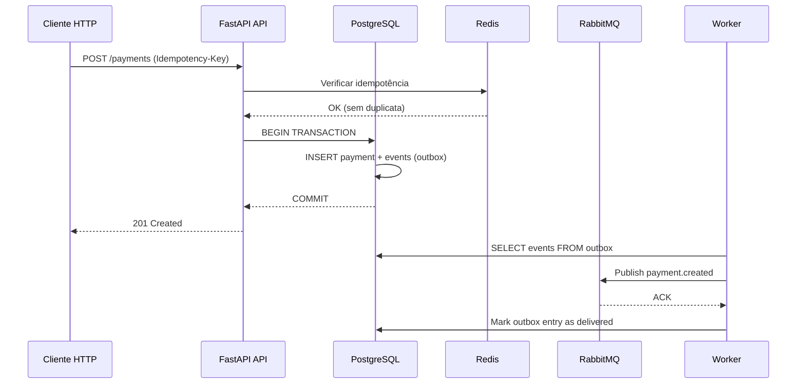

# 💳 py-payments-ledger

[](https://www.python.org/)
[](https://fastapi.tiangolo.com/)
[](https://www.postgresql.org/)
[](LICENSE)
[](https://github.com/seu-usuario/py-payments-ledger)

**Motor de pagamentos com ledger contábil double-entry** — arquitetura de produção em Python/FastAPI com padrões escaláveis.

Demonstra: **outbox pattern**, **idempotência**, **RBAC/ABAC**, **rate limiting distribuído**, **observabilidade** (Prometheus/Grafana) e **processamento assíncrono** via RabbitMQ. Ideal para aprender padrões modernos de sistemas de pagamento.

> 📚 **Propósito:** Referência arquitetural, exercício educacional e base para plataforma SaaS. Ver [ROADMAP.md](ROADMAP.md) para evolução até SaaS rentável.

---

## ✨ Características principais

| Feature | Descrição |
|---------|-----------|
| **Outbox Pattern** | Estado + eventos salvos atomicamente no banco; worker consome e publica para RabbitMQ |
| **At-least-once delivery** | Garantia com DLQ (dead-letter queue) e retry automático |
| **Idempotência** | Via `Idempotency-Key` armazenado em Redis (evita pagamentos duplicados) |
| **Multi-tenant** | `X-Tenant-Id` header com isolamento robusto de dados |
| **Autenticação** | JWT HS256 com claims personalizados (tenant, roles, plan, region) |
| **Autorização** | RBAC (role-based) + ABAC (atributos: plan, region) com fallback |
| **Rate limiting** | Redis token bucket por tenant/user/grupo (read/write) |
| **Observabilidade** | Logs JSON com correlation ID, métricas Prometheus, dashboards Grafana |
| **Auditoria** | Registro imutável de logins, mudanças administrativas e denies |
| **Ledger contábil** | Double-entry automático, balanço validado |

---

## 🚀 Início Rápido (5 minutos)

### Opção 1: Docker Compose (⭐ Recomendado)

```bash
# 1. Clonar o repositório
git clone https://github.com/seu-usuario/py-payments-ledger.git
cd py-payments-ledger

# 2. Configurar variáveis de ambiente
cp .env.example .env

# 3. Iniciar infraestrutura (PostgreSQL, Redis, RabbitMQ)
./scripts/up.sh

# 4. Executar migrações do banco
./scripts/migrate.sh

# 5. Popular dados de teste
./scripts/seed.sh

# 6. Validar com smoke tests
./scripts/smoke.sh
```

**URLs locais:**
- 🌐 **API Swagger:** http://localhost:8000/docs
- 🐰 **RabbitMQ UI:** http://localhost:15672 (guest/guest)
- 📊 **Prometheus:** http://localhost:9090
- 📈 **Grafana:** http://localhost:3000 (admin/admin)

### Opção 2: Python local (Python 3.12+)

```bash
# 1. Criar ambiente virtual
python -m venv .venv
source .venv/bin/activate  # Windows: .\.venv\Scripts\Activate.ps1

# 2. Instalar dependências
pip install -e . && pip install -r requirements-dev.txt

# 3. Iniciar servidor (com reload automático)
uvicorn src.api.main:app --reload --port 8000

# 4. Acessar
# http://localhost:8000/docs
```

> **Nota:** Opção 2 requer PostgreSQL, Redis e RabbitMQ rodando separadamente.

---

## 🔐 Credenciais de Teste

O script `seed.sh` cria usuários de teste:

| Email | Senha | Tenant | Papel |
|-------|-------|--------|-------|
| `admin@local` | `admin123` | global | Admin |
| `ops@demo` | `ops123` | demo | Ops |
| `sales@demo` | `sales123` | demo | Sales |

---

## 📚 Documentação e APIs

| Recurso | URL | Descrição |
|---------|-----|-----------|
| **Swagger UI** | `/docs` | Explorador interativo da API |
| **ReDoc** | `/redoc` | Documentação alternativa |
| **OpenAPI JSON** | `/openapi.json` | Spec completa |
| **Health Check** | `/healthz` | Status da aplicação |
| **Ready Check** | `/readyz` | Pronto para receber tráfego |
| **Métricas** | `/metrics` | Prometheus format |

**Arquivos de spec:**
```
docs/api/
  ├── openapi.json      # OpenAPI 3.0
  └── openapi.yaml      # YAML format
```

**Exportar spec atualizado:**
```bash
./scripts/api-export.sh
```

---

## 📂 Estrutura do Repositório

```
py-payments-ledger/
├── src/                       # Código-fonte principal
│   ├── api/                   # FastAPI: routers + middlewares
│   │   ├── main.py            # Aplicação FastAPI
│   │   ├── middlewares.py      # Correlation ID, Rate Limit, Chaos
│   │   ├── deps/              # Dependências (auth, db)
│   │   └── routers/           # Endpoints (auth, payments, ledger, admin)
│   │
│   ├── worker/                # RabbitMQ dispatcher + event handlers
│   │   ├── main.py            # Worker entrypoint
│   │   └── handlers/          # Processadores de eventos
│   │
│   ├── application/           # Lógica de negócio (use cases)
│   │   ├── payments.py        # Fluxo de pagamentos
│   │   ├── ledger.py          # Gerenciador de ledger
│   │   ├── outbox.py          # Event sourcing
│   │   └── security.py        # JWT + senha
│   │
│   ├── infrastructure/        # Camada de infraestrutura
│   │   ├── db/                # PostgreSQL: models, session, seed
│   │   ├── mq/                # RabbitMQ: producer, consumer
│   │   └── redis/             # Redis: idempotência, rate limiting
│   │
│   ├── domain/                # Value Objects e tipos de domínio
│   │
│   └── shared/                # Utilitários (config, logs, metrics)
│
├── migrations/                # Alembic: versionamento de DB
│   └── versions/              # Scripts SQL
│
├── tests/                     # Testes (unit, integration, e2e)
│   ├── unit/                  # Testes unitários
│   └── integration/           # Testes com DB/Redis/RabbitMQ
│
├── docs/                      # Documentação
│   ├── api/                   # OpenAPI specs
│   ├── architecture/          # Diagramas (mmd, ERD)
│   └── screenshots/           # Capturas da interface
│
├── observability/             # Prometheus + Grafana
│   ├── prometheus/            # prometheus.yml
│   └── grafana/               # Dashboards JSON
│
├── docker/                    # Dockerfiles para API e Worker
├── scripts/                   # Bash helpers (up.sh, seed.sh, etc)
├── docker-compose.yml         # Orquestração local (postgres, redis, rabbitmq)
├── pyproject.toml             # Configuração Python (deps, black, mypy)
├── requirements.txt           # Dependências principais
├── requirements-dev.txt       # Dependências de desenvolvimento
├── ROADMAP.md                 # Plano estratégico de evolução
└── README.md                  # Este arquivo
```

### Arquitetura em Camadas

```
┌─────────────────────────────────────────┐
│  API (FastAPI + Middlewares)            │  <- HTTP requests
├─────────────────────────────────────────┤
│  Application (Use Cases / Services)     │  <- Lógica de negócio
├─────────────────────────────────────────┤
│  Domain (Value Objects, Entities)       │  <- Tipos de domínio
├─────────────────────────────────────────┤
│  Infrastructure                         │  <- DB, Redis, RabbitMQ
│  ├─ PostgreSQL (state + outbox)         │
│  ├─ Redis (idempotência, rate limit)    │
│  └─ RabbitMQ (event delivery)           │
└─────────────────────────────────────────┘
```

---

## 🧪 Testes

```bash
# Rodar todos os testes
python -m pytest tests/ -v

# Apenas unitários (rápido)
python -m pytest tests/unit/ -v

# Com cobertura
python -m pytest tests/ --cov=src --cov-report=html

# Modo watch (rerun ao salvar)
ptw tests/
```

**Cobertura esperada:** 80%+ de cobertura de código.

---

## 🔄 Fluxo Principal: Criar um Pagamento



---

## 📊 Padrões Implementados

### 1. **Outbox Pattern**
Garante entrega confiável de eventos sem perder mensagens:
- Estado + eventos salvos atomicamente no banco (mesma transação)
- Worker lê outbox e publica para RabbitMQ
- Marca como delivered após confirmação
- Retry automático em caso de falha

```python
# Exemplo: Registrar pagamento com evento
db.execute(
    insert(Payment).values(tenant_id=t, amount=100),
    insert(OutboxEvent).values(
        event_type="payment.created",
        payload={"payment_id": p_id}
    )
)
db.commit()
```

### 2. **Idempotência via Idempotency-Key**
Previne duplicações de operações críticas:
- Cliente envia header `Idempotency-Key: uuid`
- Servidor armazena em Redis + retorna resposta em cache
- Válido por 24h (TTL configurável)

```bash
curl -X POST http://localhost:8000/payments \
  -H "Idempotency-Key: 550e8400-e29b-41d4-a716-446655440000" \
  -H "X-Tenant-Id: tenant_123" \
  -d '{"amount": 100, "currency": "USD"}'
```

### 3. **RBAC (Role-Based Access Control)**
Autorização baseada em papéis:
- Admin, Ops, Sales
- Controle por endpoints
- Exemplo: `Admin` pode gerenciar tenants, `Sales` apenas lê

### 4. **ABAC (Attribute-Based Access Control)**
Autorização granular por atributos:
- `plan`: free, pro, enterprise
- `region`: us-east, eu-central, etc
- Exemplo: `free plan` limitado a 10 API calls/mês

### 5. **Rate Limiting Distribuído**
Token bucket em Redis por tenant/user:
- Read limit: 1000 req/min
- Write limit: 100 req/min
- Retorna `429 Too Many Requests` ao exceder

---

## 🔍 Exemplos de Uso

### Criar um Pagamento

```bash
# 1. Autenticar
TOKEN=$(curl -X POST http://localhost:8000/auth/login \
  -d '{"email":"ops@demo","password":"ops123"}' | jq -r '.access_token')

# 2. Criar pagamento
curl -X POST http://localhost:8000/payments \
  -H "Authorization: Bearer $TOKEN" \
  -H "X-Tenant-Id: tenant_demo" \
  -H "Idempotency-Key: payment_001" \
  -H "Content-Type: application/json" \
  -d '{
    "amount": 100,
    "currency": "USD",
    "description": "Compra de serviço"
  }'

# 3. Consultar ledger
curl http://localhost:8000/ledger/balances \
  -H "Authorization: Bearer $TOKEN" \
  -H "X-Tenant-Id: tenant_demo"
```

### Verificar Métricas

```bash
# Prometheus
curl http://localhost:9090/api/v1/query?query=payment_total_amount_sum

# Grafana dashboards já pré-configurados
# Abrir http://localhost:3000
```

---

## 🚨 Troubleshooting

| Problema | Solução |
|----------|---------|
| `Connection refused (Redis)` | Rodar `./scripts/up.sh` para iniciar containers |
| `RBAC deny: insufficient permissions` | Usar usuário com papel correto (ver credenciais) |
| `Rate limit exceeded (429)` | Aguardar 60 segundos ou aumentar `RATE_LIMIT_*` em `.env` |
| `Outbox event stuck` | Verificar RabbitMQ no http://localhost:15672 |
| `Test fails: database locked` | Usar `pytest -n auto` para paralelizar sem conflicts |

---

## 🔒 Segurança em Produção

⚠️ **Antes de fazer deploy:**

- [ ] Nunca use JWT_SECRET fraco — utilize Vault/Secrets Manager com >=32 bytes
- [ ] Configure TLS para todos os serviços (HTTPS, amqps, etc)
- [ ] Escaneie dependências por CVEs: `pip-audit`
- [ ] Ative HTTPS, CORS restritivo, CSRF tokens
- [ ] Migre JWT HS256 para RS256 (assimétrico) ou OIDC/Keycloak
- [ ] Habilite rate limiting, WAF (Cloudflare)
- [ ] Implemente audit logging completo
- [ ] Use read-only replicas para queries
- [ ] Criptografe dados sensíveis em repouso
- [ ] Teste disaster recovery quarterly

**Checklist de segurança:**
```bash
# Verificar dependências
pip-audit

# Lint de segurança
bandit -r src/

# Análise estática
mypy --strict src/
```

---

## 📚 Recursos Adicionais

- 📖 **[ROADMAP.md](ROADMAP.md)** — Plano de evolução para SaaS rentável
- 🎓 **[docs/tutorials/](docs/tutorials/)** — Séries educacionais
- 🏗️ **[docs/architecture/](docs/architecture/)** — Diagramas e decisões
- 🔌 **[docs/api/openapi.json](docs/api/openapi.json)** — Spec completa
- 🧪 **[tests/](tests/)** — Exemplos de testes unitários e de integração

---

## 🤝 Contribuindo

Adoramos contribuições! Siga estes passos:

1. **Fork** o repositório
2. **Clone** seu fork: `git clone https://github.com/seu-usuario/py-payments-ledger.git`
3. **Branch temático:** `git checkout -b feat/sua-feature`
4. **Implementar** com testes: `pytest tests/`
5. **Lint/format:**
   ```bash
   ruff check . --fix
   black .
   mypy .
   ```
6. **Commit:** `git commit -am "feat: descrição clara da mudança"`
7. **Push:** `git push origin feat/sua-feature`
8. **PR** no GitHub com descrição do problema resolvido

**Guidelines:**
- Manter 80%+ de cobertura de testes
- Adicionar testes para funcionalidades novas
- Documentar decisões em ADRs (ver `docs/adr/`)
- Manter compatibilidade com Python 3.12+

---

## 🙏 Agradecimentos

Inspirado por padrões de sistemas de pagamento em produção: Stripe, PayPal, Wise.

---

## 📞 Suporte & Comunidade

- 🐛 **Issues:** [GitHub Issues](https://github.com/seu-usuario/py-payments-ledger/issues)
- 💬 **Discussions:** [GitHub Discussions](https://github.com/seu-usuario/py-payments-ledger/discussions)
- 📧 **Email:** contact@py-payments-ledger.dev
- 🐦 **Twitter:** [@py_payments](https://twitter.com/py_payments)

---

## 📄 Licença

MIT License — veja [LICENSE](LICENSE) para detalhes.

**Mantido por:** [Your Name/Team] | **Última atualização:** Fevereiro 2026

